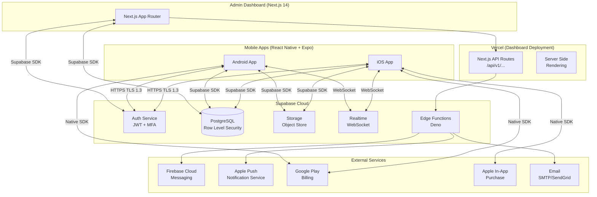
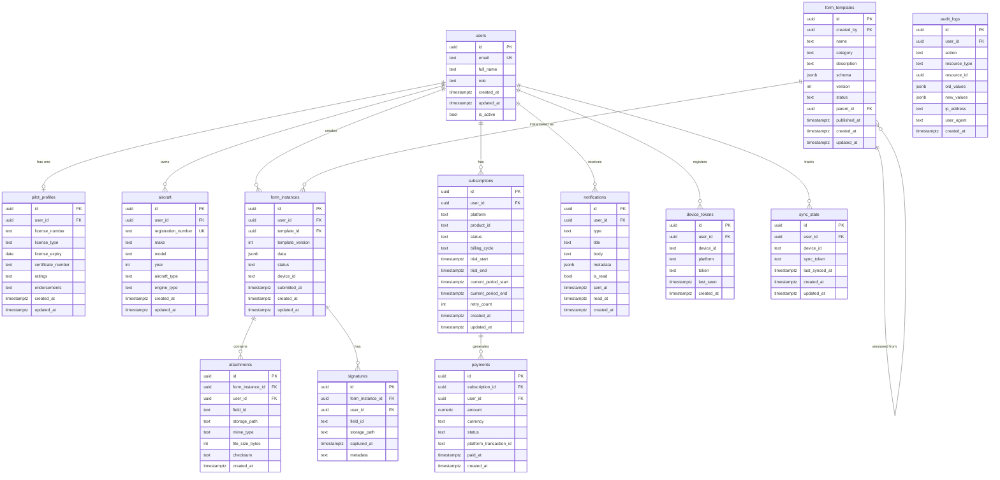
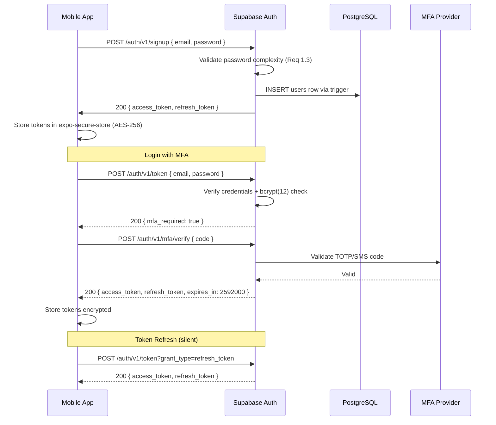
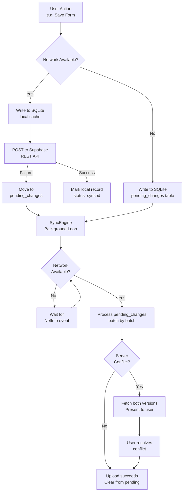

# Design Document: PilotForms™ SaaS Platform

## Overview

PilotForms™ is a subscription-based mobile SaaS platform that digitizes aviation paperwork for pilots. The system provides native iOS and Android mobile applications built with React Native + Expo, a web-based Admin Dashboard built with Next.js, and a cloud backend powered by Supabase (PostgreSQL + Auth + Storage + Realtime).

The platform is designed **offline-first**: pilots can create, edit, and submit forms without network connectivity, with automatic synchronization when connectivity returns. All data is encrypted at rest (AES-256) and in transit (TLS 1.3). A flexible JSON-based form definition language enables administrators to create and version complex aviation forms without custom development.

### Key Design Decisions

| Concern | Decision | Rationale |
|---|---|---|
| Backend | Supabase (PostgreSQL + Auth + Storage + Realtime) | Batteries-included BaaS with RLS, real-time subscriptions, and managed auth reduces backend complexity for a startup |
| Mobile | React Native + Expo + TypeScript | Single codebase for iOS + Android, Expo managed workflow for faster iteration |
| Admin | Next.js 14 + App Router + Tailwind CSS | SSR + RSC for fast dashboards; Vercel deployment is trivial |
| State (Mobile) | TanStack Query + Zustand | TanStack Query handles server-state (cache, sync, pagination); Zustand for lightweight client-state (auth, UI) |
| State (Admin) | TanStack Query + Zustand | Same rationale; consistent mental model across apps |
| Offline DB | Expo SQLite (via `expo-sqlite`) | Lighter than WatermelonDB, ships with Expo, sufficient for aviation form payload sizes |
| PDF | `react-native-html-to-pdf` + `pdf-lib` on server | Client-side quick export + server-side high-fidelity branded PDF |
| Deployment | Vercel (Dashboard) + Supabase Cloud | Zero-ops deployment; both support auto-scaling |


---

## Architecture

### High-Level System Architecture



### Clean Architecture Layers

```mermaid
graph LR
    subgraph Presentation["Presentation Layer"]
        SC[Screens / Pages]
        CM[Components]
        HK[Hooks]
    end

    subgraph Domain["Domain Layer"]
        UC[Use Cases]
        EN[Entities]
        RI[Repository Interfaces]
    end

    subgraph Data["Data Layer"]
        RP[Repositories\n(concrete impl)]
        DS[Data Sources\n(Supabase / SQLite)]
        MA[Mappers / DTOs]
    end

    SC --> HK
    HK --> UC
    UC --> RI
    UC --> EN
    RI --> RP
    RP --> DS
    DS --> MA
```

The dependency rule flows strictly inward: Presentation → Domain ← Data. Domain entities and repository interfaces have zero dependency on Supabase, SQLite, or any framework.


---

## Components and Interfaces

### Mobile App Core Components

| Component | Responsibility | Key Interfaces |
|---|---|---|
| `AuthService` | Supabase Auth wrapper — sign in, sign up, MFA, token refresh | `IAuthService` |
| `FormParser` | Parse + validate JSON form template definitions | `IFormParser` |
| `FormRenderer` | Render form fields, handle validation, auto-save | `IFormRenderer` |
| `SyncEngine` | Detect connectivity, queue changes, upload/download, conflict resolution | `ISyncEngine` |
| `OfflineStorage` | Expo SQLite CRUD operations for forms, templates, attachments | `IOfflineStorage` |
| `PDFGenerator` | Render form data to PDF using html template | `IPDFGenerator` |
| `EncryptionService` | AES-256 encryption/decryption for sensitive fields | `IEncryptionService` |
| `PushNotificationService` | Register device tokens, handle incoming notifications | `IPushNotificationService` |
| `SubscriptionManager` | Check subscription status, initiate purchases, handle webhooks | `ISubscriptionManager` |
| `AttachmentService` | Photo capture, compress, upload/download via Supabase Storage | `IAttachmentService` |

### Admin Dashboard Core Components

| Component | Responsibility |
|---|---|
| `UserRepository` | CRUD + search for user accounts via Supabase |
| `TemplateRepository` | CRUD + versioning for form templates |
| `AnalyticsService` | Aggregate metrics queries, CSV export |
| `NotificationBroadcaster` | Send bulk push/email notifications to segments |
| `AuditLogRepository` | Append-only audit log reads with pagination/filtering |
| `SubscriptionRepository` | View and manage subscription states |

### Repository Pattern Interfaces

```typescript
// Domain interfaces — no Supabase import allowed here
export interface IFormTemplateRepository {
  findById(id: string): Promise<FormTemplate | null>;
  findAll(filter: TemplateFilter): Promise<PaginatedResult<FormTemplate>>;
  create(template: CreateFormTemplateDto): Promise<FormTemplate>;
  update(id: string, patch: UpdateFormTemplateDto): Promise<FormTemplate>;
  deprecate(id: string): Promise<void>;
  findVersionHistory(templateId: string): Promise<FormTemplateVersion[]>;
}

export interface IFormInstanceRepository {
  findByUser(userId: string, filter: FormFilter): Promise<PaginatedResult<FormInstance>>;
  findById(id: string): Promise<FormInstance | null>;
  create(instance: CreateFormInstanceDto): Promise<FormInstance>;
  update(id: string, patch: UpdateFormInstanceDto): Promise<FormInstance>;
  search(userId: string, query: SearchQuery): Promise<PaginatedResult<FormInstance>>;
}

export interface ISyncRepository {
  getPendingChanges(deviceId: string): Promise<SyncChange[]>;
  markSynced(changeIds: string[]): Promise<void>;
  getServerChanges(deviceId: string, since: Date): Promise<SyncChange[]>;
  getSyncToken(deviceId: string): Promise<string | null>;
  updateSyncToken(deviceId: string, token: string): Promise<void>;
}
```


---

## Data Models

### Entity Relationship Diagram




### PostgreSQL Schema (Key Tables)

```sql
-- Enable extensions
CREATE EXTENSION IF NOT EXISTS "pgcrypto";
CREATE EXTENSION IF NOT EXISTS "pg_trgm";    -- full-text search
CREATE EXTENSION IF NOT EXISTS "btree_gin";  -- GIN indexes

-- users (managed by Supabase Auth, extended via trigger)
CREATE TABLE public.users (
  id          UUID PRIMARY KEY REFERENCES auth.users(id) ON DELETE CASCADE,
  email       TEXT NOT NULL UNIQUE,
  full_name   TEXT,
  role        TEXT NOT NULL DEFAULT 'pilot' CHECK (role IN ('pilot','admin','super_admin')),
  is_active   BOOLEAN NOT NULL DEFAULT true,
  created_at  TIMESTAMPTZ NOT NULL DEFAULT NOW(),
  updated_at  TIMESTAMPTZ NOT NULL DEFAULT NOW()
);

-- pilot_profiles
CREATE TABLE public.pilot_profiles (
  id                UUID PRIMARY KEY DEFAULT gen_random_uuid(),
  user_id           UUID NOT NULL REFERENCES public.users(id) ON DELETE CASCADE,
  license_number    TEXT,
  license_type      TEXT,
  license_expiry    DATE,
  certificate_number TEXT,
  ratings           TEXT[],
  endorsements      TEXT[],
  created_at        TIMESTAMPTZ NOT NULL DEFAULT NOW(),
  updated_at        TIMESTAMPTZ NOT NULL DEFAULT NOW(),
  UNIQUE (user_id)
);

-- form_templates
CREATE TABLE public.form_templates (
  id           UUID PRIMARY KEY DEFAULT gen_random_uuid(),
  created_by   UUID NOT NULL REFERENCES public.users(id),
  name         TEXT NOT NULL,
  category     TEXT NOT NULL,
  description  TEXT,
  schema       JSONB NOT NULL,           -- JSON form definition
  version      INT NOT NULL DEFAULT 1,
  status       TEXT NOT NULL DEFAULT 'draft' CHECK (status IN ('draft','published','deprecated')),
  parent_id    UUID REFERENCES public.form_templates(id),  -- previous version
  published_at TIMESTAMPTZ,
  created_at   TIMESTAMPTZ NOT NULL DEFAULT NOW(),
  updated_at   TIMESTAMPTZ NOT NULL DEFAULT NOW()
);

CREATE INDEX idx_form_templates_category ON public.form_templates(category);
CREATE INDEX idx_form_templates_status   ON public.form_templates(status);

-- form_instances
CREATE TABLE public.form_instances (
  id               UUID PRIMARY KEY DEFAULT gen_random_uuid(),
  user_id          UUID NOT NULL REFERENCES public.users(id) ON DELETE CASCADE,
  template_id      UUID NOT NULL REFERENCES public.form_templates(id),
  template_version INT NOT NULL,
  data             JSONB NOT NULL DEFAULT '{}',
  status           TEXT NOT NULL DEFAULT 'draft' CHECK (status IN ('draft','submitted','synced')),
  device_id        TEXT,
  submitted_at     TIMESTAMPTZ,
  created_at       TIMESTAMPTZ NOT NULL DEFAULT NOW(),
  updated_at       TIMESTAMPTZ NOT NULL DEFAULT NOW()
);

CREATE INDEX idx_form_instances_user       ON public.form_instances(user_id);
CREATE INDEX idx_form_instances_template   ON public.form_instances(template_id);
CREATE INDEX idx_form_instances_status     ON public.form_instances(status);
CREATE INDEX idx_form_instances_created    ON public.form_instances(created_at DESC);
-- GIN index for full-text search on form data
CREATE INDEX idx_form_instances_data_gin   ON public.form_instances USING GIN (data jsonb_path_ops);

-- audit_logs (append-only, no UPDATE/DELETE allowed via RLS)
CREATE TABLE public.audit_logs (
  id            UUID PRIMARY KEY DEFAULT gen_random_uuid(),
  user_id       UUID REFERENCES public.users(id),
  action        TEXT NOT NULL,
  resource_type TEXT NOT NULL,
  resource_id   UUID,
  old_values    JSONB,
  new_values    JSONB,
  ip_address    INET,
  user_agent    TEXT,
  created_at    TIMESTAMPTZ NOT NULL DEFAULT NOW()
);

CREATE INDEX idx_audit_logs_user       ON public.audit_logs(user_id);
CREATE INDEX idx_audit_logs_resource   ON public.audit_logs(resource_type, resource_id);
CREATE INDEX idx_audit_logs_created    ON public.audit_logs(created_at DESC);
```

### Row Level Security (RLS) Policies

```sql
-- Enable RLS on all tables
ALTER TABLE public.users            ENABLE ROW LEVEL SECURITY;
ALTER TABLE public.pilot_profiles   ENABLE ROW LEVEL SECURITY;
ALTER TABLE public.form_instances   ENABLE ROW LEVEL SECURITY;
ALTER TABLE public.audit_logs       ENABLE ROW LEVEL SECURITY;

-- Users: can only read/update their own record
CREATE POLICY users_self ON public.users
  USING (id = auth.uid());

-- Pilot profiles: own record only
CREATE POLICY pilot_profiles_self ON public.pilot_profiles
  USING (user_id = auth.uid());

-- Form instances: own records only (data isolation Req 5.7)
CREATE POLICY form_instances_own ON public.form_instances
  FOR ALL USING (user_id = auth.uid());

-- Admins can read all form instances
CREATE POLICY form_instances_admin_read ON public.form_instances
  FOR SELECT USING (
    EXISTS (SELECT 1 FROM public.users WHERE id = auth.uid() AND role IN ('admin','super_admin'))
  );

-- Audit logs: admins read-only, append via service role only
CREATE POLICY audit_logs_admin_read ON public.audit_logs
  FOR SELECT USING (
    EXISTS (SELECT 1 FROM public.users WHERE id = auth.uid() AND role IN ('admin','super_admin'))
  );
-- No UPDATE or DELETE policy — enforces immutability (Req 17.3)
```


---

## Components and Interfaces

### Mobile App — Feature Module Structure

```
apps/mobile/
├── src/
│   ├── features/
│   │   ├── auth/
│   │   │   ├── screens/          # LoginScreen, RegisterScreen, MFAScreen
│   │   │   ├── components/       # AuthForm, PasswordInput
│   │   │   ├── hooks/            # useAuth, useSession
│   │   │   ├── usecases/         # SignInUseCase, SignOutUseCase, RefreshTokenUseCase
│   │   │   ├── repositories/     # AuthRepository (interface + impl)
│   │   │   └── types.ts
│   │   ├── forms/
│   │   │   ├── screens/          # FormListScreen, FormDetailScreen, FormEditorScreen
│   │   │   ├── components/       # FormRenderer, FieldComponents, SignatureCapture, PhotoAttachment
│   │   │   ├── hooks/            # useForms, useFormEditor, useFormSync
│   │   │   ├── usecases/         # CreateFormUseCase, SubmitFormUseCase, ExportPDFUseCase
│   │   │   ├── repositories/     # FormRepository, FormTemplateRepository
│   │   │   └── types.ts
│   │   ├── sync/
│   │   │   ├── SyncEngine.ts     # Core sync orchestrator
│   │   │   ├── SyncQueue.ts      # Offline operation queue
│   │   │   ├── ConflictResolver.ts
│   │   │   └── types.ts
│   │   ├── subscriptions/
│   │   │   ├── screens/          # SubscriptionScreen, PaywallScreen
│   │   │   ├── hooks/            # useSubscription
│   │   │   ├── usecases/         # PurchaseSubscriptionUseCase
│   │   │   └── types.ts
│   │   └── notifications/
│   │       ├── NotificationService.ts
│   │       └── types.ts
│   ├── core/
│   │   ├── database/             # SQLite setup, migrations
│   │   ├── network/              # Supabase client, interceptors
│   │   ├── encryption/           # EncryptionService (AES-256)
│   │   ├── storage/              # SecureStorage wrapper
│   │   └── di/                   # Dependency injection container
│   ├── shared/
│   │   ├── components/           # Button, TextInput, LoadingSpinner, ErrorBoundary
│   │   ├── hooks/                # useNetworkStatus, useDebounce
│   │   └── utils/                # dateUtils, validationUtils
│   └── navigation/               # RootNavigator, AuthStack, AppStack
```

### Key Interfaces (Domain Layer)

```typescript
// Repository interfaces — domain layer, zero framework dependencies

interface IFormRepository {
  create(form: CreateFormDto): Promise<Result<FormInstance>>
  findById(id: string): Promise<Result<FormInstance>>
  findByUser(userId: string, filters: FormFilters): Promise<Result<PaginatedResult<FormInstance>>>
  update(id: string, data: UpdateFormDto): Promise<Result<FormInstance>>
  delete(id: string): Promise<Result<void>>
  findPendingSync(): Promise<Result<FormInstance[]>>
}

interface IFormTemplateRepository {
  findAll(): Promise<Result<FormTemplate[]>>
  findById(id: string): Promise<Result<FormTemplate>>
  findByVersion(id: string, version: number): Promise<Result<FormTemplate>>
}

interface IAuthRepository {
  signIn(credentials: SignInDto): Promise<Result<Session>>
  signOut(): Promise<Result<void>>
  refreshSession(): Promise<Result<Session>>
  verifyMFA(code: string): Promise<Result<Session>>
}

interface ISyncEngine {
  sync(): Promise<Result<SyncReport>>
  queueOperation(op: SyncOperation): Promise<void>
  getStatus(): SyncStatus
}

interface IEncryptionService {
  encrypt(data: string): Promise<string>
  decrypt(ciphertext: string): Promise<string>
}

// Shared Result type — eliminates thrown exceptions
type Result<T> = { success: true; data: T } | { success: false; error: AppError }
```

### Admin Dashboard — Module Structure

```
apps/admin/
├── app/
│   ├── (auth)/
│   │   └── login/page.tsx
│   ├── (dashboard)/
│   │   ├── layout.tsx             # Sidebar, Header
│   │   ├── page.tsx               # Analytics overview
│   │   ├── users/page.tsx
│   │   ├── forms/
│   │   │   ├── page.tsx           # Template list
│   │   │   └── [id]/page.tsx      # Template editor
│   │   ├── subscriptions/page.tsx
│   │   └── audit/page.tsx
│   └── api/
│       └── v1/
│           ├── forms/route.ts
│           ├── users/route.ts
│           └── analytics/route.ts
├── features/
│   ├── analytics/
│   ├── form-builder/
│   ├── users/
│   └── subscriptions/
└── lib/
    ├── supabase/                  # Server + browser clients
    └── utils/
```

### Supabase Edge Functions

| Function | Trigger | Responsibility |
|---|---|---|
| `send-notification` | HTTP / DB webhook | Dispatch FCM/APNS push, SendGrid email |
| `generate-pdf` | HTTP | Server-side PDF generation via pdf-lib |
| `process-subscription` | HTTP | Webhook handler for Play/App Store events |
| `aggregate-analytics` | Cron (15 min) | Materialize analytics aggregations |
| `rotate-encryption-keys` | Cron (90 days) | Key rotation orchestration |

---

## Data Models

### PostgreSQL Schema

```sql
-- Users (extends Supabase auth.users)
CREATE TABLE public.profiles (
  id          UUID PRIMARY KEY REFERENCES auth.users(id) ON DELETE CASCADE,
  full_name   TEXT NOT NULL,
  role        TEXT NOT NULL DEFAULT 'pilot' CHECK (role IN ('pilot', 'admin')),
  created_at  TIMESTAMPTZ NOT NULL DEFAULT now(),
  updated_at  TIMESTAMPTZ NOT NULL DEFAULT now()
);

-- Subscriptions
CREATE TABLE public.subscriptions (
  id                  UUID PRIMARY KEY DEFAULT gen_random_uuid(),
  user_id             UUID NOT NULL REFERENCES public.profiles(id) ON DELETE CASCADE,
  status              TEXT NOT NULL CHECK (status IN ('trialing', 'active', 'past_due', 'canceled', 'expired')),
  plan                TEXT NOT NULL CHECK (plan IN ('monthly', 'annual')),
  trial_ends_at       TIMESTAMPTZ,
  current_period_end  TIMESTAMPTZ NOT NULL,
  external_id         TEXT,                 -- App Store / Play Store transaction ID
  created_at          TIMESTAMPTZ NOT NULL DEFAULT now(),
  updated_at          TIMESTAMPTZ NOT NULL DEFAULT now()
);

-- Form Templates
CREATE TABLE public.form_templates (
  id          UUID PRIMARY KEY DEFAULT gen_random_uuid(),
  slug        TEXT NOT NULL UNIQUE,
  name        TEXT NOT NULL,
  description TEXT,
  version     INTEGER NOT NULL DEFAULT 1,
  schema      JSONB NOT NULL,              -- JSON form definition
  is_active   BOOLEAN NOT NULL DEFAULT true,
  deprecated  BOOLEAN NOT NULL DEFAULT false,
  created_by  UUID REFERENCES public.profiles(id),
  created_at  TIMESTAMPTZ NOT NULL DEFAULT now(),
  updated_at  TIMESTAMPTZ NOT NULL DEFAULT now()
);

CREATE INDEX idx_form_templates_slug ON public.form_templates(slug);
CREATE INDEX idx_form_templates_active ON public.form_templates(is_active) WHERE is_active = true;

-- Form Instances
CREATE TABLE public.form_instances (
  id                  UUID PRIMARY KEY DEFAULT gen_random_uuid(),
  user_id             UUID NOT NULL REFERENCES public.profiles(id) ON DELETE CASCADE,
  template_id         UUID NOT NULL REFERENCES public.form_templates(id),
  template_version    INTEGER NOT NULL,
  status              TEXT NOT NULL DEFAULT 'draft' CHECK (status IN ('draft', 'completed', 'synced')),
  data                JSONB NOT NULL DEFAULT '{}',
  submitted_at        TIMESTAMPTZ,
  created_at          TIMESTAMPTZ NOT NULL DEFAULT now(),
  updated_at          TIMESTAMPTZ NOT NULL DEFAULT now()
);

CREATE INDEX idx_form_instances_user ON public.form_instances(user_id);
CREATE INDEX idx_form_instances_template ON public.form_instances(template_id);
CREATE INDEX idx_form_instances_status ON public.form_instances(status);
CREATE INDEX idx_form_instances_submitted ON public.form_instances(submitted_at DESC);
-- Full-text search index
CREATE INDEX idx_form_instances_fts ON public.form_instances USING gin(to_tsvector('english', data::text));

-- Signatures
CREATE TABLE public.signatures (
  id              UUID PRIMARY KEY DEFAULT gen_random_uuid(),
  form_instance_id UUID NOT NULL REFERENCES public.form_instances(id) ON DELETE CASCADE,
  field_id        TEXT NOT NULL,
  storage_path    TEXT NOT NULL,          -- Supabase Storage path
  captured_at     TIMESTAMPTZ NOT NULL DEFAULT now(),
  user_id         UUID NOT NULL REFERENCES public.profiles(id)
);

-- Photo Attachments
CREATE TABLE public.attachments (
  id              UUID PRIMARY KEY DEFAULT gen_random_uuid(),
  form_instance_id UUID NOT NULL REFERENCES public.form_instances(id) ON DELETE CASCADE,
  field_id        TEXT NOT NULL,
  storage_path    TEXT NOT NULL,
  file_size_bytes INTEGER,
  mime_type       TEXT,
  created_at      TIMESTAMPTZ NOT NULL DEFAULT now()
);

-- Sync Tokens (per device)
CREATE TABLE public.sync_tokens (
  id          UUID PRIMARY KEY DEFAULT gen_random_uuid(),
  user_id     UUID NOT NULL REFERENCES public.profiles(id) ON DELETE CASCADE,
  device_id   TEXT NOT NULL,
  last_sync   TIMESTAMPTZ NOT NULL DEFAULT now(),
  UNIQUE(user_id, device_id)
);

-- Audit Log (append-only)
CREATE TABLE public.audit_logs (
  id          BIGSERIAL PRIMARY KEY,
  user_id     UUID REFERENCES public.profiles(id),
  action      TEXT NOT NULL,
  resource    TEXT NOT NULL,
  resource_id TEXT,
  old_value   JSONB,
  new_value   JSONB,
  ip_address  TEXT,
  created_at  TIMESTAMPTZ NOT NULL DEFAULT now()
);

-- Notifications
CREATE TABLE public.notifications (
  id          UUID PRIMARY KEY DEFAULT gen_random_uuid(),
  user_id     UUID NOT NULL REFERENCES public.profiles(id) ON DELETE CASCADE,
  type        TEXT NOT NULL,
  title       TEXT NOT NULL,
  body        TEXT NOT NULL,
  read        BOOLEAN NOT NULL DEFAULT false,
  delivered   BOOLEAN NOT NULL DEFAULT false,
  created_at  TIMESTAMPTZ NOT NULL DEFAULT now()
);
```

### Row Level Security Policies

```sql
-- Profiles: users can only read/update their own profile
ALTER TABLE public.profiles ENABLE ROW LEVEL SECURITY;
CREATE POLICY "profiles_owner" ON public.profiles
  USING (id = auth.uid());

-- Form instances: users access only their own
ALTER TABLE public.form_instances ENABLE ROW LEVEL SECURITY;
CREATE POLICY "form_instances_owner" ON public.form_instances
  USING (user_id = auth.uid());

-- Form templates: all authenticated users can read; only admins can write
ALTER TABLE public.form_templates ENABLE ROW LEVEL SECURITY;
CREATE POLICY "templates_read" ON public.form_templates FOR SELECT
  USING (auth.role() = 'authenticated');
CREATE POLICY "templates_write" ON public.form_templates FOR ALL
  USING (auth.jwt() ->> 'role' = 'admin');

-- Subscriptions: owner read, admin full access
ALTER TABLE public.subscriptions ENABLE ROW LEVEL SECURITY;
CREATE POLICY "subscriptions_owner" ON public.subscriptions
  USING (user_id = auth.uid() OR auth.jwt() ->> 'role' = 'admin');
```

### Mobile SQLite Schema (Offline Storage)

```sql
CREATE TABLE local_form_instances (
  id              TEXT PRIMARY KEY,
  template_id     TEXT NOT NULL,
  template_version INTEGER NOT NULL,
  status          TEXT NOT NULL DEFAULT 'draft',
  data            TEXT NOT NULL,          -- JSON string, encrypted
  sync_status     TEXT NOT NULL DEFAULT 'pending', -- pending | synced | conflict
  created_at      TEXT NOT NULL,
  updated_at      TEXT NOT NULL
);

CREATE TABLE local_form_templates (
  id              TEXT PRIMARY KEY,
  slug            TEXT NOT NULL,
  version         INTEGER NOT NULL,
  schema          TEXT NOT NULL,          -- JSON string
  cached_at       TEXT NOT NULL
);

CREATE TABLE sync_queue (
  id              INTEGER PRIMARY KEY AUTOINCREMENT,
  operation       TEXT NOT NULL,          -- create | update | delete
  resource        TEXT NOT NULL,
  resource_id     TEXT NOT NULL,
  payload         TEXT NOT NULL,          -- JSON string
  retry_count     INTEGER NOT NULL DEFAULT 0,
  created_at      TEXT NOT NULL
);
```

### TypeScript Entity Types

```typescript
// Domain entities — framework agnostic

export interface FormTemplate {
  id: string
  slug: string
  name: string
  description: string | null
  version: number
  schema: FormSchema
  isActive: boolean
  deprecated: boolean
  createdAt: Date
  updatedAt: Date
}

export interface FormSchema {
  sections: FormSection[]
  metadata: FormMetadata
}

export interface FormSection {
  id: string
  title: string
  fields: FormField[]
}

export type FormField =
  | TextField
  | NumericField
  | DateField
  | TimeField
  | DropdownField
  | CheckboxField
  | SignatureField
  | PhotoField

export interface BaseField {
  id: string
  label: string
  required: boolean
  conditional?: ConditionalRule
}

export interface TextField extends BaseField {
  type: 'text'
  maxLength?: number
  placeholder?: string
}

export interface NumericField extends BaseField {
  type: 'numeric'
  min?: number
  max?: number
  unit?: string
}

export interface SignatureField extends BaseField {
  type: 'signature'
}

export interface PhotoField extends BaseField {
  type: 'photo'
  maxPhotos: number
}

export interface ConditionalRule {
  fieldId: string
  operator: 'equals' | 'not_equals' | 'contains' | 'greater_than'
  value: string | number | boolean
}

export interface FormInstance {
  id: string
  userId: string
  templateId: string
  templateVersion: number
  status: 'draft' | 'completed' | 'synced'
  data: Record<string, FieldValue>
  submittedAt: Date | null
  createdAt: Date
  updatedAt: Date
}

export type FieldValue = string | number | boolean | string[] | SignatureData | PhotoData[]

export interface SignatureData {
  storagePath: string
  capturedAt: Date
}

export interface PhotoData {
  storagePath: string
  mimeType: string
  fileSizeBytes: number
}

export interface Subscription {
  id: string
  userId: string
  status: 'trialing' | 'active' | 'past_due' | 'canceled' | 'expired'
  plan: 'monthly' | 'annual'
  trialEndsAt: Date | null
  currentPeriodEnd: Date
}

export interface Session {
  userId: string
  accessToken: string
  refreshToken: string
  expiresAt: Date
  role: 'pilot' | 'admin'
}

export interface AppError {
  code: string
  message: string
  details?: unknown
}
```

---

## Error Handling

### Layered Error Strategy

All repository methods and use cases return `Result<T>` — a discriminated union — instead of throwing. This makes error paths explicit and type-safe.

```typescript
// Usage pattern in a use case
export class SubmitFormUseCase {
  constructor(
    private readonly formRepo: IFormRepository,
    private readonly syncEngine: ISyncEngine
  ) {}

  async execute(formId: string): Promise<Result<FormInstance>> {
    const formResult = await this.formRepo.findById(formId)
    if (!formResult.success) return formResult  // propagate error

    const form = formResult.data
    if (form.status === 'completed') {
      return { success: false, error: { code: 'FORM_ALREADY_SUBMITTED', message: 'Form has already been submitted.' } }
    }

    const updateResult = await this.formRepo.update(formId, { status: 'completed', submittedAt: new Date() })
    if (!updateResult.success) return updateResult

    await this.syncEngine.queueOperation({ type: 'update', resource: 'form_instances', resourceId: formId })
    return updateResult
  }
}
```

### Error Code Registry

| Code | Layer | Description |
|---|---|---|
| `AUTH_INVALID_CREDENTIALS` | Auth | Wrong email or password |
| `AUTH_MFA_REQUIRED` | Auth | MFA verification needed |
| `AUTH_SESSION_EXPIRED` | Auth | JWT expired, re-auth required |
| `AUTH_RATE_LIMITED` | Auth | Too many failed attempts |
| `FORM_NOT_FOUND` | Forms | Form instance not found |
| `FORM_ALREADY_SUBMITTED` | Forms | Cannot edit submitted form |
| `FORM_VALIDATION_FAILED` | Forms | Field validation errors |
| `TEMPLATE_INVALID_SCHEMA` | Templates | JSON schema parse failure |
| `SYNC_CONFLICT` | Sync | Offline/server conflict detected |
| `SYNC_UPLOAD_FAILED` | Sync | Network error during upload |
| `SUBSCRIPTION_EXPIRED` | Subscriptions | Access restricted |
| `SUBSCRIPTION_PAYMENT_FAILED` | Subscriptions | Payment processing error |
| `STORAGE_UPLOAD_FAILED` | Storage | Photo/signature upload failure |
| `PDF_GENERATION_FAILED` | PDF | PDF creation error |
| `NETWORK_UNAVAILABLE` | Network | No internet connectivity |
| `UNKNOWN_ERROR` | Global | Unexpected error — see logs |

### Retry & Circuit Breaker Policy

- **Network requests**: 3 retries with exponential backoff (1s, 2s, 4s)
- **Sync queue**: retry up to 5 times, then flag as `conflict` and alert user
- **External services** (push notifications, payment): circuit breaker opens after 5 consecutive failures; auto-recovers after 60 seconds
- **PDF generation**: single retry; on failure return error with error ID for support reference

---

## Correctness Properties

These properties are verifiable via property-based testing (using `fast-check` on mobile/admin, `pg_tap` on the database layer).

### Round-Trip Properties

```typescript
// 1. Form template parse ↔ format round-trip
// For any valid FormTemplate t:
//   parse(format(t)) ≡ t
property("template round-trip", fc.record({ schema: validFormSchema() }), (t) => {
  const json = formatTemplate(t)
  const parsed = parseTemplate(json)
  return parsed.success && deepEqual(parsed.data, t)
})

// 2. PDF text extraction round-trip
// For any FormInstance f with only text/numeric fields:
//   extractText(generatePDF(f)) contains all field values of f
```

### Idempotence Properties

```typescript
// 3. Sync idempotence — syncing twice yields the same state
// syncOnce(state) ≡ syncTwice(state)
property("sync idempotence", fc.array(pendingSyncOperation()), async (ops) => {
  await applySync(ops)
  const stateAfterFirst = await getServerState()
  await applySync(ops)
  const stateAfterSecond = await getServerState()
  return deepEqual(stateAfterFirst, stateAfterSecond)
})
```

### Invariants

```typescript
// 4. RLS data isolation — user A cannot access user B's form instances
// For any two distinct users A, B and any form instance owned by B:
//   queryAsUser(A, formOwnedBy(B)) returns empty result set

// 5. Subscription access gate invariant
// A user with status ∉ {active, trialing} cannot create new FormInstances

// 6. Encryption invariant
// No FormInstance.data field value appears in plaintext in SQLite storage
//   encrypt(decrypt(ciphertext)) = ciphertext
//   decrypt(encrypt(plaintext)) = plaintext
```

### Boundary Conditions

- Empty form submissions (all optional fields blank) are valid
- Forms with maximum field count (50+ fields) render within 1 second
- Sync payload at exactly 5 MB boundary is accepted; 5 MB + 1 byte is rejected with pagination required
- Offline queue with 0 items completes sync in < 100ms
- Conflict resolution always produces a deterministic winner (last-write-wins by `updated_at` timestamp)

---

## Testing Strategy

### Layers and Tools

| Layer | Tool | Coverage Target |
|---|---|---|
| Domain (use cases, entities) | Jest / Vitest | 90% |
| Repository (data layer) | Jest + Supabase local | 80% |
| Sync Engine | Jest + mock SQLite | 85% |
| API Routes (admin) | Vitest + supertest | 80% |
| UI Components (mobile) | React Native Testing Library | 70% |
| UI Components (admin) | Testing Library + Storybook | 70% |
| E2E Mobile | Detox | Critical paths |
| E2E Admin | Playwright | Critical paths |
| Property-Based | fast-check | Key invariants |
| Database RLS | pgTAP | All policies |

### Critical Test Paths

1. **Auth flow**: register → verify email → login → MFA → access protected resource
2. **Offline form cycle**: create form offline → close app → reconnect → verify sync
3. **Subscription gate**: trial expires → attempt form creation → verify block → renew → verify access
4. **Conflict resolution**: edit form on device A and B while offline → reconnect both → verify deterministic winner
5. **PDF export**: complete form with signature + photo → export PDF → verify all fields present
6. **Template versioning**: submit form on v1 → admin publishes v2 → verify v1 form renders correctly

### Local Development Setup

```bash
# Start Supabase locally
supabase start

# Run mobile app
cd apps/mobile && npx expo start

# Run admin dashboard
cd apps/admin && npm run dev

# Run all tests
npm run test          # unit + integration
npm run test:e2e      # Detox (mobile) + Playwright (admin)
npm run test:db       # pgTAP RLS policies
```

---

## Correctness Properties

*A property is a characteristic or behavior that should hold true across all valid executions of a system — essentially, a formal statement about what the system should do. Properties serve as the bridge between human-readable specifications and machine-verifiable correctness guarantees.*

After completing prework analysis on all 20 requirements and their acceptance criteria, the following universally-quantified properties were identified. Redundant properties were consolidated (e.g., 6.2, 10.6, and 11.7 all concern PDF content completeness and are merged; 5.4 and 12.3 both concern filter correctness and are merged).

---

### Property 1: Invalid Credentials Always Rejected With Error Message

*For any* pair of credentials where at least one field is incorrect or malformed, the Auth_Service SHALL return a non-success status code and a non-empty, descriptive error message.

**Validates: Requirements 1.2**

---

### Property 2: Password Complexity Validation

*For any* password string, the Auth_Service SHALL accept it if and only if it contains at least 8 characters, at least one uppercase letter, at least one lowercase letter, at least one digit, and at least one special character.

**Validates: Requirements 1.3**

---

### Property 3: Role-Based Admin Access Control

*For any* user record with an arbitrary role value, the Admin_Dashboard SHALL grant access if and only if the user's role is `admin` or `super_admin`.

**Validates: Requirements 1.6**

---

### Property 4: Offline Write Persistence

*For any* form instance data written while the network is unavailable, the Offline_Storage SHALL contain that data upon subsequent read from the local store, preserving all field values.

**Validates: Requirements 2.1, 11.4**

---

### Property 5: Sync Chronological Ordering

*For any* sequence of form modifications made offline with recorded timestamps, after synchronization the server SHALL contain those modifications ordered by ascending timestamp, with no reordering.

**Validates: Requirements 2.4**

---

### Property 6: Conflict Detection on Divergent Versions

*For any* pair of form instance versions (one offline, one server-side) where both have been modified after a common ancestor version, the Sync_Engine SHALL detect a conflict and expose both versions for user resolution rather than silently overwriting.

**Validates: Requirements 2.5**

---

### Property 7: Sync Clears Pending Queue

*For any* set of pending offline changes, after a successful synchronization run, the Offline_Storage pending queue SHALL be empty and the local cache SHALL reflect the server's current state.

**Validates: Requirements 2.7**

---

### Property 8: Form Template Schema Validation (Accept/Reject)

*For any* JSON document, the Form_Parser SHALL accept it if and only if it fully conforms to the defined form schema specification, and SHALL reject any document that violates the schema with a descriptive error message.

**Validates: Requirements 3.2, 3.7, 9.1, 9.3**

---

### Property 9: Template Version History Completeness

*For any* sequence of modifications applied to a Form_Template, the version history table SHALL contain one entry per modification, each entry carrying the modification timestamp and the author's user identifier, in the order modifications were applied.

**Validates: Requirements 3.4**

---

### Property 10: Field Type Coverage

*For each* field type defined in the form schema specification (text, numeric, date, time, dropdown, checkbox, signature, photo), a Form_Template containing only that field type SHALL parse successfully without error.

**Validates: Requirements 3.6**

---

### Property 11: Field-Level Validation Correctness

*For any* Form_Template with defined validation rules (required, numeric range, date constraint) and *for any* input value, the Form_Renderer's validator SHALL return `valid` if and only if the input satisfies all rules, and `invalid` with a non-empty error description otherwise.

**Validates: Requirements 4.2, 4.4**

---

### Property 12: Conditional Field Visibility Consistency

*For any* Form_Template with conditional field definitions and *for any* combination of trigger field values, the set of visible fields SHALL match exactly the set prescribed by the conditional logic in the template definition.

**Validates: Requirements 4.6**

---

### Property 13: Form Instance Ownership Invariant

*For any* form instance created by any authenticated user, the `user_id` field on that instance SHALL equal the `id` of the user who submitted it. No form instance SHALL be accessible to any user whose `id` does not match the instance's `user_id`, unless the accessing user holds an admin role.

**Validates: Requirements 5.2, 5.7**

---

### Property 14: Form History Descending Sort

*For any* user with N form instances having distinct submission timestamps, a request for that user's form history SHALL return all N instances in strictly descending order by `submitted_at`.

**Validates: Requirements 5.3**

---

### Property 15: Filter Correctness

*For any* dataset of form instances and *for any* filter combination (date range, template type, status), the returned result set SHALL contain every instance that satisfies all filter criteria and SHALL contain no instance that fails any filter criterion.

**Validates: Requirements 5.4, 12.3**

---

### Property 16: PDF Content Completeness

*For any* Form_Instance containing an arbitrary combination of field values, signature images, and photo attachments, the generated PDF SHALL contain all field labels, all field values, all signature images, and all attached photos at the locations specified in the Form_Template.

**Validates: Requirements 6.2, 10.6, 11.7**

---

### Property 17: PDF Metadata Completeness

*For any* Form_Instance, the generated PDF SHALL embed at minimum the form type identifier, the submission timestamp, the pilot's full name, and the unique form instance identifier as PDF metadata.

**Validates: Requirements 6.5**

---

### Property 18: Signature DPI Invariant

*For any* captured signature, the PNG image produced by the Form_Renderer SHALL have dimensions that correspond to at least 300 DPI resolution, and SHALL have a transparent background channel.

**Validates: Requirements 6.6, 10.3**

---

### Property 19: PDF Round-Trip Field Preservation

*For any* Form_Instance with arbitrary field values and labels, generating a PDF from that instance and then extracting the text content from the PDF SHALL recover all field labels and all field values without truncation or alteration.

**Validates: Requirements 6.7**

---

### Property 20: Suspended User Write Restriction

*For any* user whose subscription is in `suspended` status, *for any* attempt to create or edit a Form_Instance, the system SHALL return an authorization error, while *for any* attempt to read an existing Form_Instance the system SHALL return the data successfully.

**Validates: Requirements 7.4**

---

### Property 21: Form Data Encryption At Rest

*For any* form instance data written to persistent storage (both server-side PostgreSQL and device-side SQLite), the raw bytes read from storage SHALL differ from the plaintext representation of the form data, evidencing that encryption has been applied.

**Validates: Requirements 8.1, 8.3**

---

### Property 22: Password Hashing Work Factor

*For any* password string, the hash stored by the Auth_Service SHALL be a valid bcrypt hash whose embedded work factor is greater than or equal to 12.

**Validates: Requirements 8.4**

---

### Property 23: Form Template Parsing Round-Trip

*For any* valid Form_Template object, the operation `parse(format(parse(json)))` SHALL produce a Form_Template that is structurally equivalent to the one produced by `parse(json)`.

**Validates: Requirements 9.4, 9.5**

---

### Property 24: Unique Field Identifier Enforcement

*For any* Form_Template JSON containing duplicate field identifier values, the Form_Parser SHALL reject the template with an error referencing the duplicate identifier. *For any* Form_Template with all-unique field identifiers, the parser SHALL accept the template.

**Validates: Requirements 9.2**

---

### Property 25: Parser Error Location Reporting

*For any* invalid Form_Template JSON with a known syntax error at a specific location, the Form_Parser's error response SHALL include a non-empty description that references the field or path where the error was detected.

**Validates: Requirements 9.6**

---

### Property 26: Signature Metadata Completeness

*For any* signature captured by any user, the signature record SHALL contain a `captured_at` timestamp and a `user_id` matching the capturing user's identifier.

**Validates: Requirements 10.4**

---

### Property 27: Photo Compression Size Constraint

*For any* image file of arbitrary original size, after the Mobile_App's compression pipeline, the resulting file size SHALL be less than or equal to 2,097,152 bytes (2 MB).

**Validates: Requirements 11.2**

---

### Property 28: Photo Attachment Count Limit

*For any* Form_Instance, attempting to attach a photo when the instance already has 10 attachments SHALL be rejected. Attaching when the count is 0–9 SHALL succeed.

**Validates: Requirements 11.3**

---

### Property 29: Multipart Upload Threshold

*For any* file attachment with a size greater than 500 KB, the Sync_Engine's upload path SHALL use multipart upload. *For any* attachment with size less than or equal to 500 KB, standard upload SHALL be used.

**Validates: Requirements 11.5**

---

### Property 30: Search Result Relevance

*For any* search query string and *for any* dataset of Form_Instances, every instance returned by the search SHALL contain the query string in at least one searchable field (text input, date, dropdown selection), and no instance lacking the query string in all searchable fields SHALL appear in results.

**Validates: Requirements 12.1**

---

### Property 31: Pagination Page Size Invariant

*For any* query returning N total records with page size P = 20, each returned page SHALL contain at most 20 records, and the total number of pages SHALL equal ceil(N / 20).

**Validates: Requirements 12.5**

---

### Property 32: Audit Log Immutability

*For any* audit log entry, attempts to UPDATE or DELETE that entry via any database role other than the append-only service role SHALL be rejected by Row Level Security policies.

**Validates: Requirements 17.3**

---

### Property 33: Form Instance Preservation on Template Update

*For any* Form_Instance that was created against template version V, after the admin publishes template version V+1, that Form_Instance's `data` field and `template_version` field SHALL remain unchanged.

**Validates: Requirements 18.1**

---

### Property 34: Historical Template Version Binding

*For any* Form_Instance with a recorded `template_version` of V, the Form_Renderer SHALL retrieve and apply template version V when rendering that instance, regardless of which version is currently published.

**Validates: Requirements 18.2**

---

### Property 35: Last-Write-Wins Conflict Resolution

*For any* pair of concurrent edits to the same Form_Instance from different devices, where edit A has timestamp T_A and edit B has timestamp T_B and T_B > T_A, the Sync_Engine SHALL resolve the conflict by retaining edit B's field values.

**Validates: Requirements 16.3**

---

### Property 36: Sync Batching Reduces Request Count

*For any* set of N ≥ 2 pending offline changes, the number of HTTP requests made during synchronization SHALL be strictly less than N (i.e., changes are batched).

**Validates: Requirements 16.7**

---

### Property 37: Notification Targeting Window

*For any* Form_Template update event, the Backend_API SHALL send push notifications to every user who has at least one Form_Instance created from that template within the past 30 days, and SHALL NOT send notifications to users whose most recent use of that template was more than 30 days ago.

**Validates: Requirements 15.1**

---

### Property 38: Analytics Aggregation Correctness

*For any* dataset of Form_Instances, the computed metrics (total submitted, average per user, per-template counts) SHALL match the values produced by a naive O(N) scan of the same dataset.

**Validates: Requirements 14.2**

---

### Property 39: Exponential Backoff Retry Pattern

*For any* failing network request, the Mobile_App SHALL perform exactly 3 retry attempts, where the delay before retry i (1-indexed) is approximately 2^(i-1) × base_delay milliseconds (within ±10% tolerance), before reporting failure to the user.

**Validates: Requirements 20.3**


---

## Error Handling

### Error Response Contract

All API endpoints return a consistent error envelope:

```typescript
interface ErrorResponse {
  error: {
    id: string;          // unique error ID (UUID) for log correlation
    code: string;        // machine-readable code, e.g. "FORM_NOT_FOUND"
    message: string;     // human-readable description
    details?: unknown;   // optional field-level validation errors
    timestamp: string;   // ISO 8601
  };
}
```

### Error Categories and Handling Strategy

| Category | HTTP Status | Mobile Behavior | Example |
|---|---|---|---|
| Validation error | 422 | Show field-level error messages | Invalid form field value |
| Authentication failure | 401 | Redirect to login screen | Token expired |
| Authorization failure | 403 | Show permission denied message | Non-admin accessing admin route |
| Not found | 404 | Show empty state with retry | Form ID not found |
| Rate limit | 429 | Show cooldown timer | 5 failed logins |
| Server error | 500 | Show error + error ID + retry option | Unexpected DB error |
| Service unavailable | 503 | Queue request for retry | Backend restart |

### Circuit Breaker (Requirement 20.6)

The mobile app and admin dashboard implement a circuit breaker for external service calls:

```
States: CLOSED → OPEN → HALF-OPEN → CLOSED

CLOSED:    Normal operation. Track consecutive failures.
           If failures >= 5: transition to OPEN.
OPEN:      All requests fail-fast immediately. 
           After 60 seconds: transition to HALF-OPEN.
HALF-OPEN: Allow 1 probe request.
           If success: transition to CLOSED.
           If failure: transition back to OPEN.
```

### Retry with Exponential Backoff (Requirement 20.3)

```typescript
const retryConfig = {
  maxAttempts: 3,
  baseDelayMs: 1000,
  maxDelayMs: 8000,
  multiplier: 2,
  jitter: true,  // ±10% randomization to avoid thundering herd
};
// Delays: ~1s, ~2s, ~4s
```

### Auto-Save and Crash Recovery (Requirement 20.4)

- Forms auto-save to Offline_Storage every 30 seconds
- On app launch, check for draft form instances with `status = 'draft'`
- Prompt user to resume or discard interrupted sessions


---

## Testing Strategy

### Dual Testing Approach

The testing strategy combines unit tests (for specific examples and edge cases) with property-based tests (for universal invariants). Both are necessary for comprehensive coverage.

### Property-Based Testing

**Library:** [fast-check](https://fast-check.dev/) (TypeScript-native, works in both Jest and Vitest environments)

**Configuration:** Minimum 100 iterations per property test. Each property test is tagged with a comment referencing the design document property.

**Tag Format:** `Feature: pilotforms-saas-platform, Property N: <property_text>`

```typescript
// Example property test (Property 23: Form Template Parsing Round-Trip)
import fc from 'fast-check';
import { parseTemplate, formatTemplate } from '../formParser';

// Feature: pilotforms-saas-platform, Property 23: Form Template Parsing Round-Trip
test('parse-format-parse round-trip produces equivalent template', () => {
  fc.assert(
    fc.property(arbitraryFormTemplate(), (template) => {
      const json = formatTemplate(template);
      const reparsed = parseTemplate(json);
      expect(reparsed).toEqual(template);
    }),
    { numRuns: 100 }
  );
});
```

### Unit Tests

Unit tests focus on:
- Specific examples (e.g., happy-path auth flow, specific field type rendering)
- Edge cases (empty inputs, boundary values, null handling)
- Integration points between components
- Error condition handling

### Test Infrastructure

```
Tools:
- Jest + ts-jest (test runner)
- React Testing Library (component tests)
- fast-check (property-based tests)
- MSW (Mock Service Worker — API mocking for integration tests)
- Detox (React Native E2E)
- Playwright (Admin Dashboard E2E)
- Supabase local dev stack (integration tests)

Coverage Targets:
- Domain layer: >90% (pure logic, highest value)
- Repository layer: >80% (with integration tests)  
- UI components: >70% (snapshot + interaction tests)
- E2E critical paths: auth, form submit, PDF export, sync
```

### Test File Co-Location

Tests live next to the code they test under a `__tests__/` subdirectory within each feature folder. Property-based tests are named `*.property.test.ts`.


---

## Authentication Flow

### Sign-Up / Sign-In Sequence



### Session Management

- Access tokens expire after 1 hour (Supabase default, configurable)
- Refresh tokens expire after 30 days of inactivity (Req 1.4)
- On 401, the SDK automatically attempts token refresh before retrying
- Tokens stored via `expo-secure-store` — AES-256 backed by iOS Keychain / Android Keystore

### Rate Limiting (Requirement 1.7)

Implemented via Supabase Auth built-in rate limiting + Edge Function middleware:
- Max 5 failed login attempts per account per 15-minute window
- On 6th attempt: return `429 Too Many Requests` with `Retry-After` header


---

## Offline Sync Architecture

### Offline-First Data Flow



### Local SQLite Schema (Offline Storage)

```sql
-- Expo SQLite local database

CREATE TABLE local_form_instances (
  id              TEXT PRIMARY KEY,
  template_id     TEXT NOT NULL,
  template_version INTEGER NOT NULL,
  data            TEXT NOT NULL,  -- JSON string, AES-256 encrypted
  status          TEXT NOT NULL DEFAULT 'draft',  -- draft | pending | synced
  created_at      TEXT NOT NULL,
  updated_at      TEXT NOT NULL,
  server_updated_at TEXT           -- server timestamp for conflict detection
);

CREATE TABLE local_form_templates (
  id       TEXT PRIMARY KEY,
  version  INTEGER NOT NULL,
  schema   TEXT NOT NULL,        -- JSON string
  cached_at TEXT NOT NULL
);

CREATE TABLE pending_changes (
  id          TEXT PRIMARY KEY,
  entity_type TEXT NOT NULL,     -- form_instance | attachment
  entity_id   TEXT NOT NULL,
  operation   TEXT NOT NULL,     -- create | update | delete
  payload     TEXT NOT NULL,     -- JSON
  created_at  TEXT NOT NULL,
  retry_count INTEGER NOT NULL DEFAULT 0,
  last_error  TEXT
);

CREATE TABLE local_attachments (
  id               TEXT PRIMARY KEY,
  form_instance_id TEXT NOT NULL,
  field_id         TEXT NOT NULL,
  local_path       TEXT NOT NULL,
  remote_path      TEXT,
  status           TEXT NOT NULL DEFAULT 'pending',  -- pending | uploaded
  file_size        INTEGER NOT NULL,
  created_at       TEXT NOT NULL
);
```

### Synchronization Protocol

1. **Connectivity Detection**: `@react-native-community/netinfo` provides network state events
2. **Initial Sync**: On first login or after >7 days offline (Req 16.5), fetch all templates and form instances from server via paginated queries (5 MB max per request, Req 19.6)
3. **Delta Sync**: Track `sync_token` per device. On reconnect, request changes since last sync token
4. **Upload Queue**: Process `pending_changes` in FIFO order (Req 2.4), batching up to 50 records per request (Req 16.7)
5. **Conflict Resolution**:
   - Compare `updated_at` timestamps: last-write-wins (Req 16.3)
   - If both diverged from common ancestor: surface conflict UI for user resolution (Req 2.5)
6. **Retry Strategy**: Exponential backoff — 1s, 2s, 4s, then exponential up to 64s ceiling
7. **Post-Sync Cleanup**: Mark synced records, update local cache (Req 2.7)

### Supabase Realtime for Live Updates (Multi-Device, Req 16.2)

```typescript
// Subscribe to real-time changes on form_instances for current user
const channel = supabase
  .channel('form-updates')
  .on(
    'postgres_changes',
    {
      event: '*',
      schema: 'public',
      table: 'form_instances',
      filter: `user_id=eq.${userId}`,
    },
    (payload) => syncEngine.handleRealtimeUpdate(payload)
  )
  .subscribe();
```

Changes propagate to all authenticated devices within ~60 seconds via WebSocket.


---

## API Design

### Versioning and Base URL

```
Mobile App  → Supabase REST API  (auto-generated from schema)
Admin App   → Next.js API Routes  /api/v1/...  (custom business logic)
Edge Functions → /functions/v1/... (notifications, PDF, webhooks)
```

All admin API routes are prefixed `/api/v1/` and follow REST conventions.

### Core Endpoints

#### Forms

```
GET    /api/v1/forms?page=1&limit=20&templateId=&status=&from=&to=
       → PaginatedResult<FormInstance>

POST   /api/v1/forms
       Body: CreateFormInstanceDto
       → FormInstance

GET    /api/v1/forms/:id
       → FormInstance

PATCH  /api/v1/forms/:id
       Body: UpdateFormInstanceDto
       → FormInstance

GET    /api/v1/forms/search?q=<query>&page=1&limit=20
       → PaginatedResult<FormInstance>
```

#### Form Templates

```
GET    /api/v1/templates?category=&status=published
       → PaginatedResult<FormTemplate>

POST   /api/v1/templates               (admin only)
       Body: CreateFormTemplateDto
       → FormTemplate

PUT    /api/v1/templates/:id/publish   (admin only)
       → FormTemplate (new version)

GET    /api/v1/templates/:id/versions
       → FormTemplateVersion[]

PATCH  /api/v1/templates/:id/deprecate (admin only)
       → FormTemplate
```

#### PDF Export

```
POST   /api/v1/forms/:id/export/pdf
       → { url: string, expiresAt: string }  (pre-signed URL, 1 hour)
```

#### Sync

```
GET    /api/v1/sync/changes?since=<syncToken>&limit=50
       → { changes: SyncChange[], nextToken: string }

POST   /api/v1/sync/batch
       Body: { changes: SyncChange[] }
       → { accepted: string[], conflicts: ConflictRecord[] }
```

### Standard Response Envelope

```typescript
// Success
interface ApiResponse<T> {
  data: T;
  meta?: {
    page: number;
    limit: number;
    total: number;
    totalPages: number;
  };
}

// Paginated type
interface PaginatedResult<T> {
  items: T[];
  meta: { page: number; limit: number; total: number; totalPages: number };
}
```

### HTTP Status Codes

| Code | Meaning |
|---|---|
| 200 | Success |
| 201 | Created |
| 204 | No content (delete) |
| 400 | Bad request / validation error |
| 401 | Unauthenticated |
| 403 | Unauthorized |
| 404 | Not found |
| 409 | Conflict (sync conflict) |
| 422 | Unprocessable entity |
| 429 | Rate limited |
| 500 | Internal server error |
| 503 | Service unavailable |


---

## Security Architecture

### Authentication and Authorization

```
Layer 1: Supabase Auth (JWT)
  - JWTs signed with HS256, 1-hour expiry
  - Refresh tokens encrypted in expo-secure-store
  - MFA via TOTP or SMS (Req 1.5)

Layer 2: Row Level Security (PostgreSQL)
  - Every table has RLS enabled
  - Policies enforce user-level data isolation (Req 5.7)
  - Service role key (server-only) bypasses RLS for admin operations

Layer 3: Role-Based Access Control
  - Roles: pilot | admin | super_admin
  - Role stored in public.users.role
  - Admin Dashboard middleware verifies role before route access
  - Supabase custom claims expose role in JWT

Layer 4: API Authorization
  - Next.js middleware validates JWT on all /api/v1/ routes
  - Admin-only routes check role claim
  - Supabase SDK passes JWT automatically for RLS enforcement
```

### Encryption

```
At Rest (Server):
  - PostgreSQL: AES-256 via Supabase Vault for sensitive columns
  - Supabase Storage: AES-256 server-side encryption for all objects
  - Encryption key rotation every 90 days (Req 8.6)

At Rest (Device):
  - SQLite database encrypted using expo-sqlite with SQLCipher
  - AES-256 key derived from device secure enclave
  - Tokens stored in expo-secure-store (iOS Keychain / Android Keystore)

In Transit:
  - TLS 1.3 enforced on all endpoints (Req 8.2)
  - HSTS enabled on Vercel and Supabase
  - Certificate pinning for mobile app production builds
```

### RBAC Matrix

| Action | Pilot | Admin | Super Admin |
|---|---|---|---|
| Create/edit own forms | ✅ | ✅ | ✅ |
| View own forms | ✅ | ✅ | ✅ |
| View all users' forms | ❌ | ✅ | ✅ |
| Manage form templates | ❌ | ✅ | ✅ |
| View analytics | ❌ | ✅ | ✅ |
| Manage users | ❌ | ✅ | ✅ |
| Manage subscriptions | ❌ | ✅ | ✅ |
| View audit logs | ❌ | ✅ | ✅ |
| Manage system settings | ❌ | ❌ | ✅ |
| Delete admin users | ❌ | ❌ | ✅ |

### Audit Trail (Requirement 17)

All write operations in the system trigger an audit log entry via PostgreSQL triggers:

```sql
CREATE OR REPLACE FUNCTION audit_trigger_fn() RETURNS TRIGGER AS $$
BEGIN
  INSERT INTO public.audit_logs (user_id, action, resource_type, resource_id, old_values, new_values)
  VALUES (
    auth.uid(),
    TG_OP,
    TG_TABLE_NAME,
    COALESCE(NEW.id, OLD.id),
    row_to_json(OLD),
    row_to_json(NEW)
  );
  RETURN COALESCE(NEW, OLD);
END;
$$ LANGUAGE plpgsql SECURITY DEFINER;

-- Apply to sensitive tables
CREATE TRIGGER audit_form_instances
  AFTER INSERT OR UPDATE OR DELETE ON public.form_instances
  FOR EACH ROW EXECUTE FUNCTION audit_trigger_fn();
```

Audit logs are stored in append-only fashion via RLS (no UPDATE/DELETE policy). After 1 year, Supabase Edge Function archives logs to cold storage (Supabase Storage / S3 compatible). 7-year retention (Req 17.3).


---

## Mobile Architecture

### State Management Decision: TanStack Query + Zustand

**TanStack Query** handles all server state:
- Automatic background refetching
- Optimistic updates for offline-perceived performance
- Cache invalidation and stale-while-revalidate strategy
- Pagination and infinite scroll out of the box
- Deduplication of concurrent requests

**Zustand** handles all client state:
- Auth session (user, tokens, role)
- UI state (modals, toasts, loading indicators)
- Sync status (online/offline, pending count)
- Active form draft (ephemeral, not persisted to SQLite)

This combination wins over Redux Toolkit because:
- Less boilerplate — no reducers, no action creators for server data
- AI-friendly: small, co-located store slices < 100 lines each
- TanStack Query's caching strategy naturally supports the offline-first pattern via `staleTime` + `gcTime` configuration
- Zustand's tiny API surface is easy to reason about

```typescript
// Auth store (Zustand)
interface AuthStore {
  user: User | null;
  session: Session | null;
  isLoading: boolean;
  signIn: (email: string, password: string) => Promise<void>;
  signOut: () => Promise<void>;
  refreshSession: () => Promise<void>;
}

// Server state (TanStack Query)
const useFormInstances = (filter: FormFilter) =>
  useInfiniteQuery({
    queryKey: ['forms', filter],
    queryFn: ({ pageParam }) => formRepository.findByUser(userId, { ...filter, cursor: pageParam }),
    getNextPageParam: (lastPage) => lastPage.meta.nextCursor,
    staleTime: 5 * 60 * 1000,  // 5 minutes
    gcTime: 30 * 60 * 1000,    // 30 minutes
  });
```

### Navigation Structure (Expo Router)

```
app/
  (auth)/
    sign-in.tsx
    sign-up.tsx
    forgot-password.tsx
    verify-email.tsx
  (app)/
    _layout.tsx          ← Tab navigator (requires auth)
    (tabs)/
      index.tsx          ← Dashboard / recent forms
      forms/
        index.tsx        ← Form list + search
        [id].tsx         ← View form instance
        new.tsx          ← Template selection
      templates/
        index.tsx        ← Browse templates
      profile/
        index.tsx        ← Pilot profile
        aircraft.tsx     ← Aircraft management
      settings/
        index.tsx
        subscription.tsx
        notifications.tsx
        security.tsx
  (form)/
    [templateId]/
      [step].tsx         ← Step-based form renderer
```

### Form Rendering Engine

The `FormRenderer` dynamically builds a React component tree from the JSON form schema:

```typescript
// JSON Field Definition (Form Template Schema)
interface FieldDefinition {
  id: string;
  type: FieldType;
  label: string;
  required?: boolean;
  validation?: ValidationRule[];
  conditions?: ConditionalRule[];  // show/hide based on other field values
  options?: SelectOption[];        // for dropdown/checkbox
  section?: string;
}

type FieldType =
  | 'text' | 'numeric' | 'date' | 'time'
  | 'dropdown' | 'checkbox' | 'signature' | 'photo';

// Renderer maps field type to React Native component
const FIELD_REGISTRY: Record<FieldType, React.ComponentType<FieldProps>> = {
  text: TextField,
  numeric: NumericField,
  date: DatePickerField,
  time: TimePickerField,
  dropdown: DropdownField,
  checkbox: CheckboxField,
  signature: SignatureField,
  photo: PhotoField,
};
```

